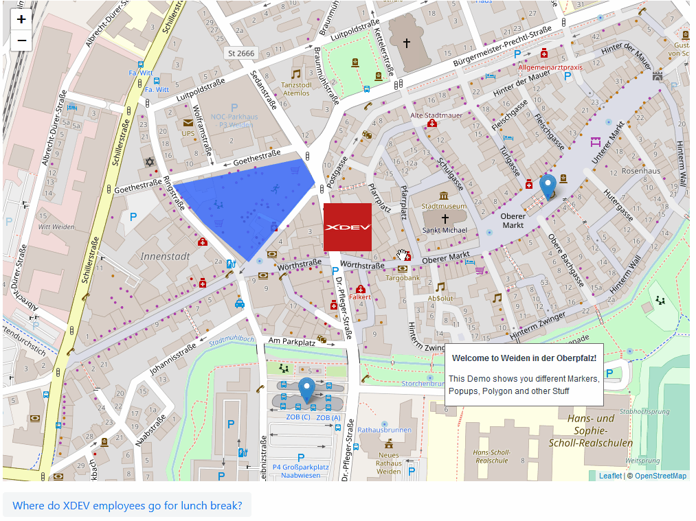

# vaadin-maps-leaflet-flow
Vaadin Flow Java API for [Leaflet Maps](https://leafletjs.com/) Component

## Installation
[Installation guide of the latest release](https://github.com/xdev-software/vaadin-maps-leaflet-flow/releases/latest#Installation)

#### Compatibility with Vaadin

| Vaadin version | vaadin-maps-leaflet-flow version |
| --- | --- |
| Vaadin 23+ (latest) | ``2+`` |
| Vaadin 14 (LTS - former release model) | ``1.x`` |

## Run the Demo
* Checkout the repo
* Run ``mvn clean install``
* Navigate into ``vaadin-maps-leaflet-flow-demo`` 
* Run ``mvn jetty:run``
* Open http://localhost:8080

  
Show example

  
  

## Dependencies and Licenses
View the [license of the current project](LICENSE) or the [summary including all dependencies](https://xdev-software.github.io/vaadin-maps-leaflet-flow/dependencies/)

## Releasing 

Before releasing:
* Consider doing a [test-deployment](https://github.com/xdev-software/vaadin-addon-template/actions/workflows/test-deploy.yml?query=branch%3Adevelop) before actually releasing.
* Check the [changelog](CHANGELOG.md)

If the ``develop`` is ready for release, create a pull request to the ``master``-Branch and merge the changes

When the release is finished do the following:
* Merge the auto-generated PR (with the incremented version number) back into the ``develop``
* Upload the generated release asset zip into the [Vaadin Directory](https://vaadin.com/directory) and update the component there

## Developing

### Software Requirements
You should have the following things installed:
* Git
* Java 11 - should be as unmodified as possible (Recommended: [Eclipse Adoptium](https://adoptium.net/temurin/releases/))
* Maven

### Recommended setup
* Install ``IntelliJ`` (Community Edition is sufficient)
  * Install the following plugins:
    * [Save Actions](https://plugins.jetbrains.com/plugin/7642-save-actions) - Provides save actions, like running the formatter or adding ``final`` to fields
    * [SonarLint](https://plugins.jetbrains.com/plugin/7973-sonarlint) - CodeStyle/CodeAnalysis
    * [Checkstyle-IDEA](https://plugins.jetbrains.com/plugin/1065-checkstyle-idea) - CodeStyle/CodeAnalysis
  * Import the project
  * Ensure that everything is encoded in ``UTF-8``
  * Ensure that the JDK/Java-Version is correct
