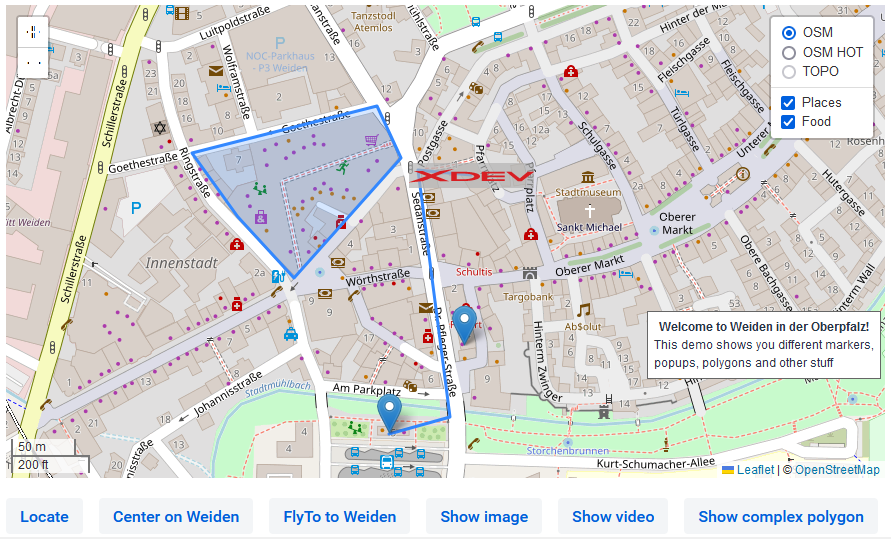

# vaadin-maps-leaflet-flow
A Vaadin Template Repo

## Installation
[Installation guide for the latest release](https://github.com/xdev-software/vaadin-maps-leaflet-flow/releases/latest#Installation)

## Run the Demo
* Checkout the repo
* Run ``mvn install && mvn -f vaadin-maps-leaflet-flow-demo spring-boot:run``
* Open http://localhost:8080

  
Show example

  
  

## Support
If you need support as soon as possible and you can't wait for any pull request, feel free to use [our support](https://xdev.software/en/services/support).

## Contributing
See the [contributing guide](./CONTRIBUTING.md) for detailed instructions on how to get started with our project.

## Dependencies and Licenses
View the [license of the current project](LICENSE) or the [summary including all dependencies](https://xdev-software.github.io/vaadin-maps-leaflet-flow/dependencies)
